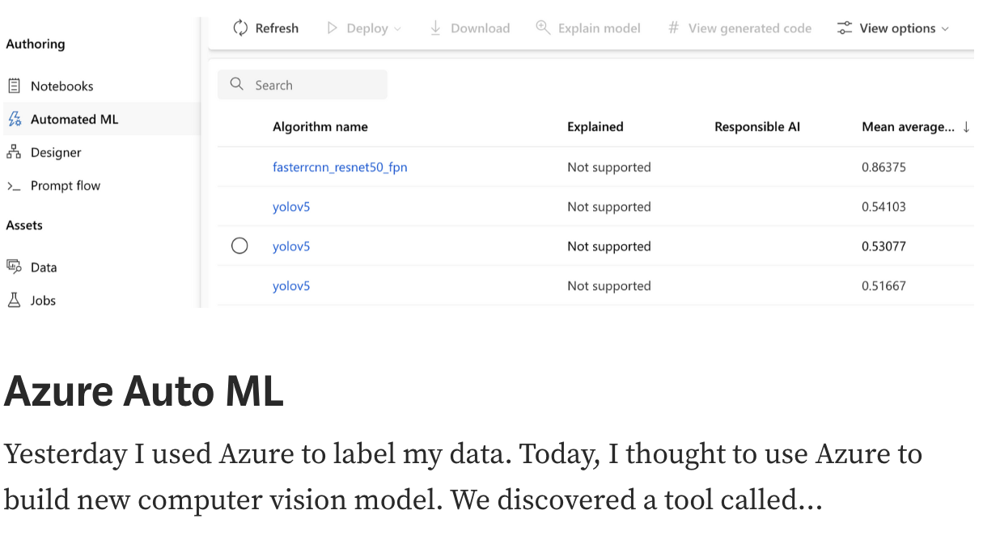
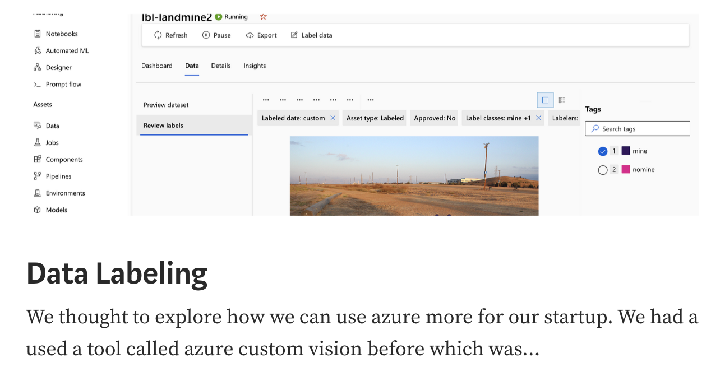
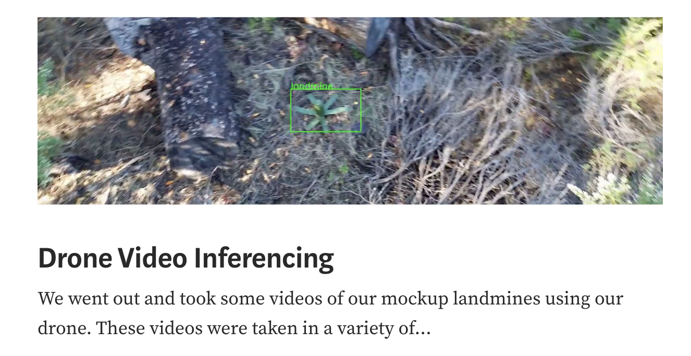

## UnVeilX - AI Powered Drone to Save a Life

## Overview

Landmines have killed or injured 1,000,000+ people in the last 50 years, with new mines being laid
out 25 times faster than they can be cleared. In Ukraine alone, >25% land has been heavily mined
since the war started.

- Existing Alternatives - People walking with metal detectors is the most common approach. Armored demining vehicles
are used sometimes but are costly. One organization HALO has tried computer vision using
satellites and drones but with limited success as detection accuracy is very low.

- Solution - UnVeilX solution is to improve the accuracy and efficiency of demining and make it less risky by training
deep learning models that pinpoint some of the most common POM-2 and POM-3 landmines used
in Ukraine by using flyby drone videos.

## Founders

- [Navin](https://github.com/navinagrawalchung07)
- [Zohran](https://github.com/zamoin)

## Learning

- [Landmine Guide](https://science.howstuffworks.com/landmine.htm)

  

## Blog, News & Webinar

- [UnVeilX Blog](https://blog.unveilx.org)
- [Halo Org](https://www.halousa.org/where-we-work/europe-and-caucasus/ukraine/)

------

  
#### Recent Posts

  <a href="https://blog.unveilx.org/azure-auto-ml-f3a17d12f7eb">
&nbsp; &nbsp; &nbsp; &nbsp;
  <a href="https://blog.unveilx.org/data-labeling-2cfd5724df28">
&nbsp; &nbsp; &nbsp; &nbsp;

  <a href="https://blog.unveilx.org/microsoft-selected-us-for-their-startup-program-b2a139c188c8">
&nbsp; &nbsp; &nbsp; &nbsp;
  <a href="https://blog.unveilx.org/drone-video-inferencing-13eaa13e5572">

------

#### Videos

